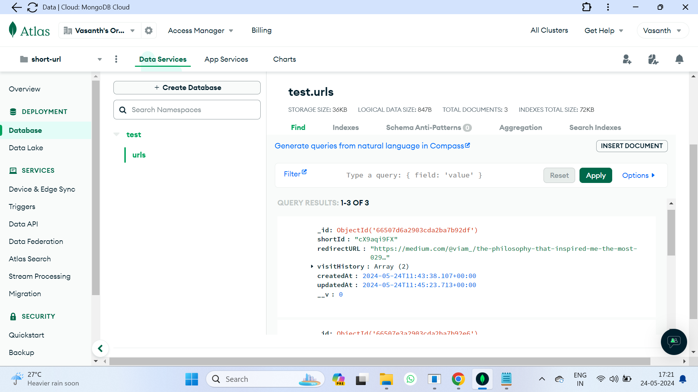
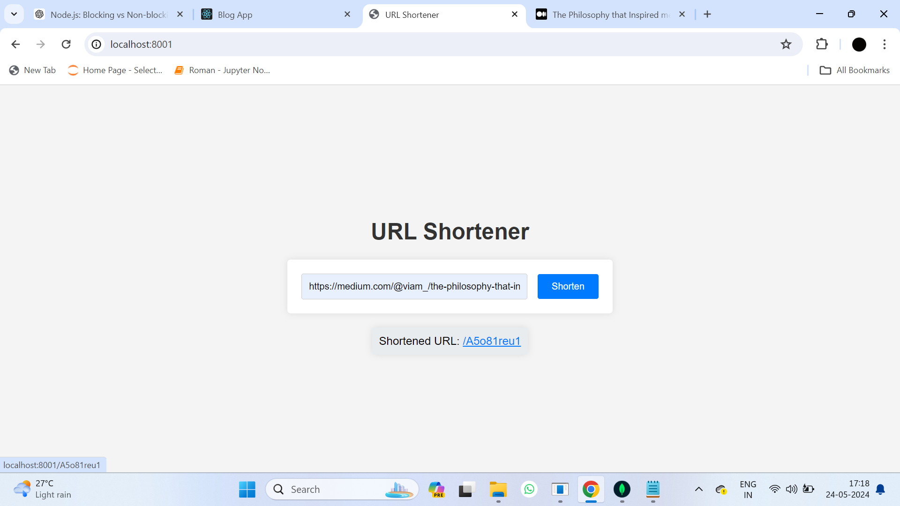

# URL Shortener

This project is a URL shortener built using Node.js, Express, and MongoDB. It allows users to shorten long URLs into more manageable, shorter ones.

## Features

- Shorten long URLs to a unique short ID
- Redirect users to the original URL when they visit the shortened URL
- Track visit history for each shortened URL

## Technologies Used

- Node.js
- Express
- MongoDB
- HTML/CSS/JavaScript
  




## Prerequisites

Before you begin, ensure you have the following installed on your system:

- Node.js - [Download & Install Node.js](https://nodejs.org/)
- MongoDB - [Download & Install MongoDB](https://www.mongodb.com/)

## Getting Started

1. Clone the repository:

    ```bash
    git clone https://github.com/vasanthsai14/url-shortener.git
    ```

2. Navigate to the project directory:

    ```bash
    cd url-shortener
    ```

3. Install dependencies:

    ```bash
    npm install
    ```

4. Set up environment variables:
   
   Create a `.env` file in the root directory of the project and add the following variables:

    ```
    PORT=8001
    MONGO_URI=your_mongodb_connection_string
    ```

5. Start the server:

    ```bash
    node index.js
    ```

6. Open your web browser and go to `http://localhost:8001` to access the URL shortener app.

## Usage

1. Enter a long URL into the input field and click "Shorten".
2. Copy the shortened URL generated.
3. Visit the shortened URL in your browser, and you will be redirected to the original URL.

## License

This project is licensed under the MIT License - see the [LICENSE](LICENSE) file for details.
